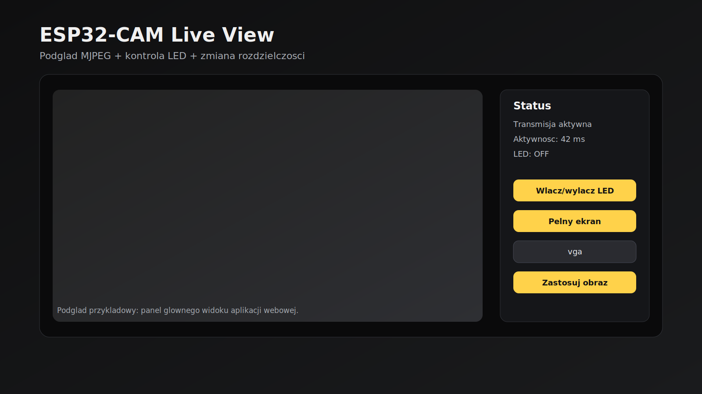
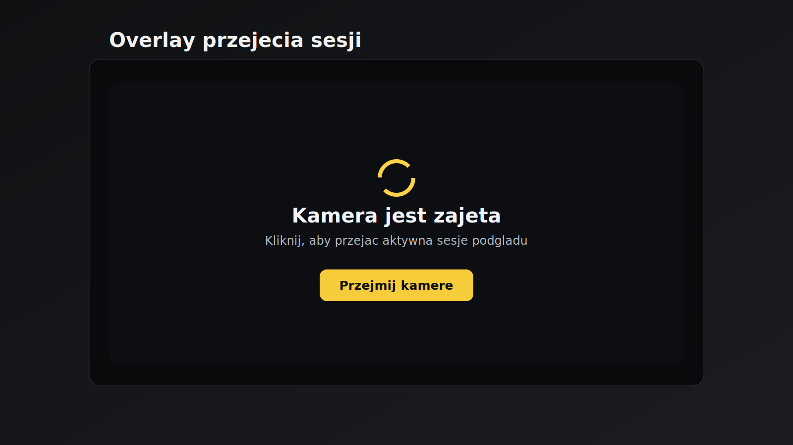
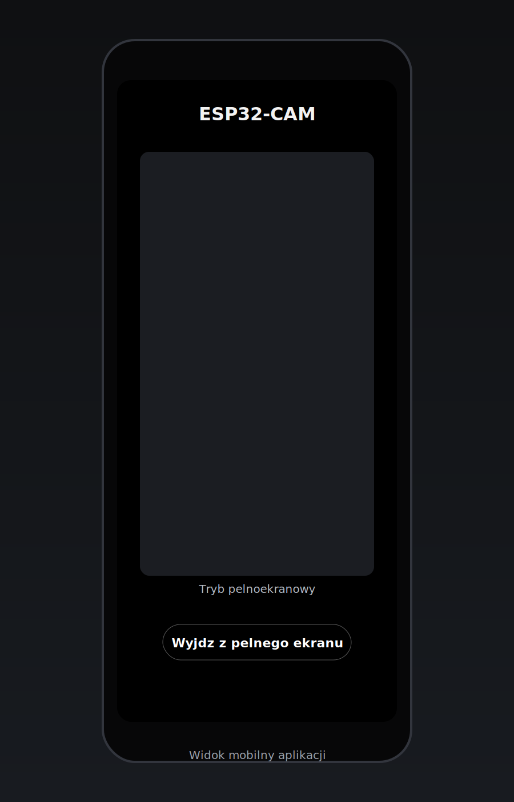
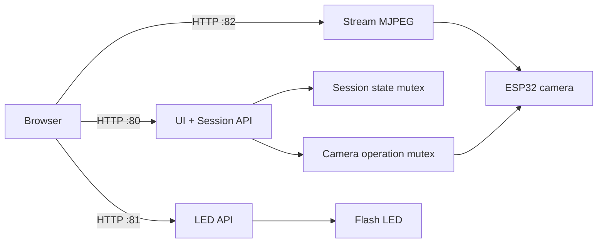

# ESP32-CAM Live Viewer

<p align="center">
	
	
	
</p>

<p align="center">
	A lightweight and fast MJPEG viewer for ESP32-CAM with single-session control,
	a camera takeover button, LED control, and image resolution switching.
</p>

---

## What is this?

This project runs three HTTP servers on ESP32-CAM:

- Port 80: UI and session/config endpoints
- Port 81: LED control and status
- Port 82: MJPEG stream

This keeps the web interface responsive while the video stream stays independent from control requests.

## Key features

- Smooth MJPEG streaming with frame recovery mechanisms
- Access control: one active session, conflict protection
- Manual takeover with a Take over camera button
- Adaptive quality: lower resolution on recurring frame issues
- Fullscreen (desktop and mobile)
- LED toggle with debounce and auto-off
- Image profile switching: qvga / vga / svga

## Gallery

The UI screenshots are stored in the repo and rendered directly on GitHub:

### Dashboard



### Session takeover screen



### Mobile view



## Quick start

### 1. Requirements

- ESP32-CAM (AI Thinker)
- USB-UART adapter for flashing
- PlatformIO (VS Code)
- Python (depending on your PlatformIO setup)

### 2. Clone and build

```bash
git clone https://github.com/<your-user>/ESP32-Cam.git
cd ESP32-Cam
pio run
```

### 3. Upload firmware

Update the port in platformio.ini (default is COM13), then run:

```bash
pio run -t upload
```

### 4. Serial monitor

```bash
pio device monitor
```

## Wi-Fi setup

On first boot, the device starts a WiFiManager configuration portal:

- SSID: ESP32CAM-Setup
- After setup, ESP32 switches to STA mode

## API endpoints

| Port | Endpoint                               | Description               |
| ---- | -------------------------------------- | ------------------------- |
| 80   | /?claim=1&viewer=<id>                  | Reserve/take over session |
| 80   | /?status=1&viewer=<id>                 | Session and LED status    |
| 80   | /?camcfg=1&viewer=<id>                 | Read current frame size   |
| 80   | /?camcfg=1&set=1&viewer=<id>&frame=vga | Change frame size         |
| 81   | /?led=toggle&viewer=<id>               | Toggle LED                |
| 81   | /?status=1&viewer=<id>                 | LED/session status        |
| 82   | /?stream=1&viewer=<id>                 | MJPEG stream              |

## Architecture



## Project structure

```text
src/
	main.cpp                # HTTP servers, sessions, stream loop
	camera_runtime.cpp      # Camera initialization and lifecycle
	camera_runtime.h
	web/
		index_html.h          # UI HTML embedded in firmware
		style_css.h           # UI styling
		app_js.h              # Client logic (takeover, reconnect, status)
platformio.ini
```

## Debug tips

- If stream does not start: check 5V power quality and current capacity
- If takeovers happen too often: inspect Wi-Fi latency and stability
- If stream stutters: test with qvga frame size

## Roadmap

- JPG snapshots directly from UI
- Additional metrics (fps, drop rate)
- Simple PIN auth before preview

---

If you want to replace placeholders with real device captures, add PNG/JPG files to docs/screenshots and update links in the Gallery section.
