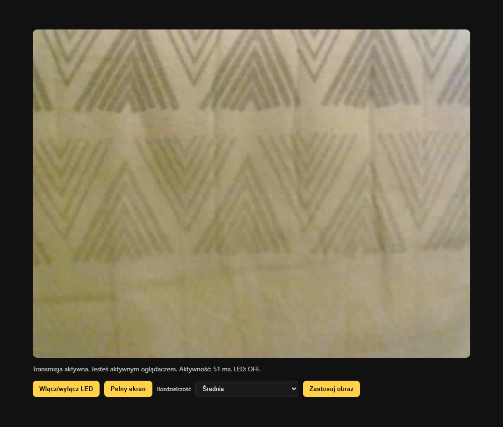
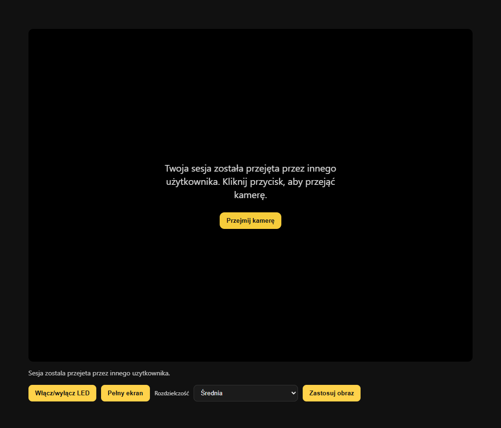
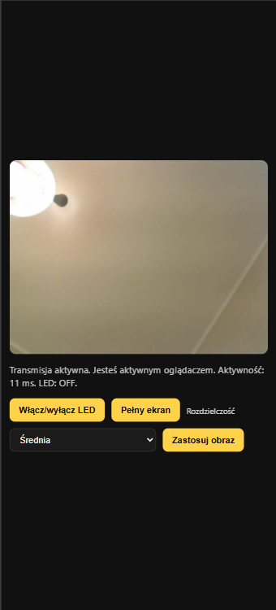
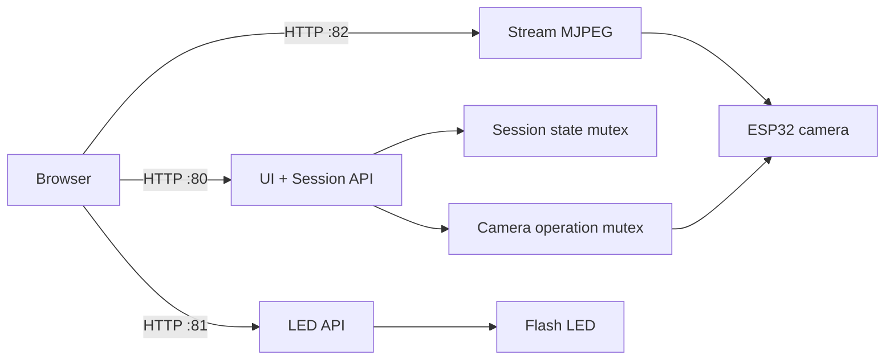

# ESP32-CAM Live Viewer

<p align="center">
	
	
	
</p>

<p align="center">
	A lightweight and fast MJPEG viewer for ESP32-CAM with single-session control,
	a camera takeover button, LED control, and image resolution switching.
</p>

---

## What is this?

This project runs three HTTP servers on ESP32-CAM:

- Port 80: UI and session/config endpoints
- Port 81: LED control and status
- Port 82: MJPEG stream

This keeps the web interface responsive while the video stream stays independent from control requests.

## Key features

- Smooth MJPEG streaming with frame recovery mechanisms
- Access control: one active session, conflict protection
- Manual takeover with a Take over camera button
- Adaptive quality: lower resolution on recurring frame issues
- Fullscreen (desktop and mobile)
- LED toggle with debounce and auto-off
- Image profile switching: qvga / vga / svga
- WiFi onboarding based on WiFiManager captive portal
- FreeRTOS task split for UI, LED API, and streaming server
- Atomic state coordination for stream ownership and runtime flags

## Gallery

### Dashboard



### Session takeover screen



### Mobile view

<p align="center">
	
</p>

## Quick start

### 1. Requirements

- ESP32-CAM (AI Thinker)
- PlatformIO (VS Code)

### 2. Clone and build

```bash
git clone https://github.com/MiskoX/ESP32-Cam.git
cd ESP32-Cam
pio run
```

## Wi-Fi setup

On first boot, the device starts a WiFiManager configuration portal:

- SSID: ESP32CAM-Setup
- After setup, ESP32 switches to STA mode

## API endpoints

| Port | Endpoint                               | Description               |
| ---- | -------------------------------------- | ------------------------- |
| 80   | /?claim=1&viewer=<id>                  | Reserve/take over session |
| 80   | /?status=1&viewer=<id>                 | Session and LED status    |
| 80   | /?camcfg=1&viewer=<id>                 | Read current frame size   |
| 80   | /?camcfg=1&set=1&viewer=<id>&frame=vga | Change frame size         |
| 81   | /?led=toggle&viewer=<id>               | Toggle LED                |
| 81   | /?status=1&viewer=<id>                 | LED/session status        |
| 82   | /?stream=1&viewer=<id>                 | MJPEG stream              |

## Architecture

The runtime uses WiFiManager for first-time network onboarding, FreeRTOS tasks for parallel HTTP handling, and atomic variables for low-latency shared state updates between server loops.



## Project structure

```text
src/
	main.cpp                # HTTP servers, sessions, stream loop
	camera_runtime.cpp      # Camera initialization and lifecycle
	camera_runtime.h
	web/
		index_html.h          # UI HTML embedded in firmware
		style_css.h           # UI styling
		app_js.h              # Client logic (takeover, reconnect, status)
platformio.ini
```
